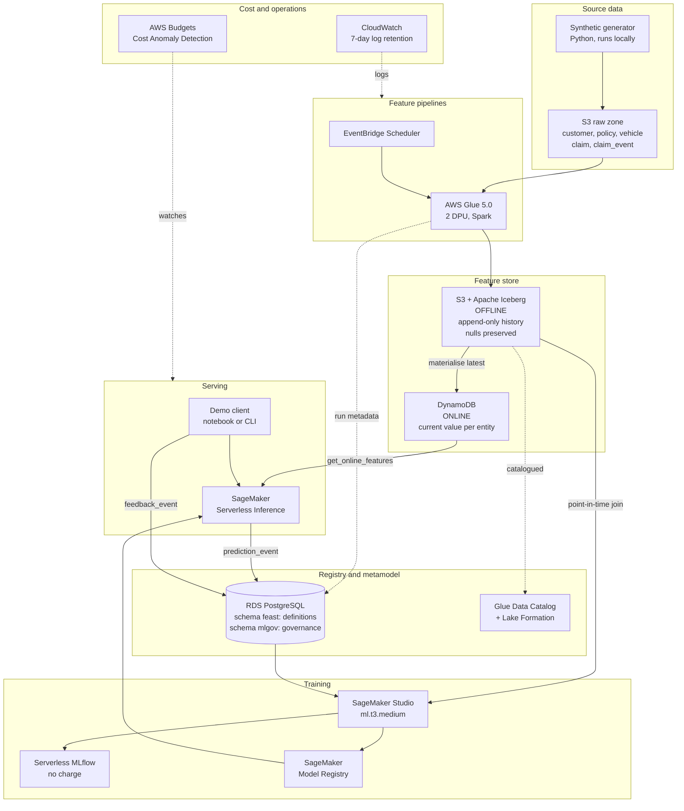

# PremiumIQ ML Platform Lab — Setup Guide

> **What this is.** A complete, repeatable setup for an AWS lab that demonstrates a governed
> ML platform for P&C insurance. Written for someone new to AWS and Terraform.
> Designed to be handed to a client engineering team as an implementation spec.
>
> **Region:** `us-east-2` · **Target cost:** ~$16/month · **Build time:** ~11 working days
>
> Open this folder in VSCode with the Claude Code extension. Everything referenced here
> lives in this repo.

---

## Table of contents

1. [Project overview and capabilities](#1-project-overview-and-capabilities)
2. [Architecture on AWS](#2-architecture-on-aws)
3. [Project setup overview](#3-project-setup-overview)
4. [AWS setup instructions](#4-aws-setup-instructions)
5. [AWS services and cost plan](#5-aws-services-and-cost-plan)
6. [IaC developer setup](#6-iac-developer-setup)
7. [Infrastructure bootstrapping](#7-infrastructure-bootstrapping)
8. [AWS cost management](#8-aws-cost-management)
9. [Development and testing workflow](#9-development-and-testing-workflow)

---

## 1. Project overview and capabilities

### What we are building

A working ML platform for a P&C carrier, demonstrated with two real insurance models.
The platform is the point; the models are how we prove it works.

### Capabilities, mapped to the roadmap

This lab builds the **2026 Fast Track** column. Nothing from the 2027 columns.

| # | Capability | What exists at the end |
|---|---|---|
| 1 | Feature definitions and entity keys | 5 feature groups, entity keys agreed, Feast registry in PostgreSQL |
| 2 | Feature store | Offline Iceberg on S3 (append-only, nulls preserved), online DynamoDB hydrated from it, both read through one library |
| 3 | Feature pipelines | Batch pipelines in Glue on a schedule; request-time features computed from the payload |
| 4 | Training sets and model registry | Both models trained against point-in-time training sets, registered in SageMaker Model Registry with model cards |
| 5 | Model serving | SageMaker Serverless Inference reading from the online store, with a defined response contract and fallback |
| 6 | Prediction store | Every prediction recorded with model version, decision, entity keys and as-of timestamps |
| 7 | Feedback and root cause | Override and outcome schema agreed; reason-code taxonomy that separates feature faults from model faults |
| 8 | Monitoring | Basic drift and data quality from Deequ + Evidently |
| 10 | ML governance | Model cards, named approvers, PII classification, deployment gate |
| 11 | Platform engineering | Container image pinned per registered model version; transformation code shared by pipeline and training |

Not in scope: streaming (1H 2027), experimentation platform (1H 2027), self-service onboarding (1H 2027), agentic AI (2027).

### The two models

| | Total loss at FNOL | Claim severity |
|---|---|---|
| **Question** | Will this vehicle be declared a total loss? | What will this claim ultimately cost? |
| **Type** | Binary classification | Regression |
| **Scored at** | First notice of loss, sub-second | FNOL and re-scored as the claim develops |
| **Entity** | `claim_id` | `claim_id` |
| **Label arrives** | 2–6 weeks (adjuster decision, then salvage) | 30 / 90 / 365 days — **three different truths** |
| **Business value** | Route to the total-loss unit on day 0 instead of day 14. Saves ~10 days of rental and storage | Reserve setting. Too low invites adverse development; too high ties up capital |

They share **14 of their features** through two different Feature Services. That is the
reuse story, made literal rather than asserted.

### The demo it has to survive

Five moves, end to end:

1. **Score a claim** — sub-second, features from the online store
2. **Reuse** — the second model consumes the same feature groups through a different Feature Service
3. **Point-in-time** — rebuild a training set and show the leakage a naive join would have produced
4. **Root cause** — an adjuster overrides and blames a feature; replay it, get a hash mismatch, prove the pipeline was stale rather than the model wrong
5. **Governance gate** — try to promote a model with an incomplete inventory row, watch the deploy fail, fill the field, watch it pass

Move 5 is the one that matters to an executive audience. The rest is table stakes.

---

## 2. Architecture on AWS



### Why each choice

| Layer | Choice | Reason |
|---|---|---|
| Offline store | **Iceberg on S3** | The only table format both Snowflake and every AWS engine write natively. Schema evolution without rewrites; snapshot-based reproducibility |
| Online store | **DynamoDB on-demand** | Idle costs only storage, and 25 GB of that is free. Single-digit-ms lookups |
| Registry + metamodel | **RDS PostgreSQL** | Feast's SQL registry is PostgreSQL. Putting the governance metamodel in a second schema on the same instance means one database to run and cross-schema SQL joins |
| Batch compute | **Glue 5.0 at 2 DPU** | Per-second billing with a 1-minute minimum. The console default of 10 DPU is 5× the cost for the same work |
| Training | **SageMaker Studio** | Idle shutdown available; `ml.t3.medium` at $0.05/hour |
| Tracking | **Serverless MLflow** | Free since December 2025. A provisioned tracking server is ~$438/month |
| Serving | **Serverless Inference** | Scales to zero between requests. A real-time endpoint bills $41–84/month whether or not anyone calls it |

### Deliberately excluded

| Excluded | Why |
|---|---|
| **Amazon MSK** | ~$548/month floor before a single partition. Streaming is 1H 2027 on the roadmap anyway |
| **NAT Gateway** | $32.85/month plus $0.045/GB. Use gateway VPC endpoints for S3 and DynamoDB — they are free |
| **Glue crawlers** | $0.147 per run minimum. Iceberg tables register directly |
| **Provisioned MLflow server** | ~$438/month for something that is free serverless |
| **Real-time endpoints** | Bills from `CreateEndpoint` to `DeleteEndpoint` regardless of traffic |

---

## 3. Project setup overview

### Repository layout

```
piq-mlplatform/
├── CLAUDE.md                  # conventions Claude Code reads automatically
├── SETUP.md                   # this file
├── README.md
├── .gitignore
│
├── bootstrap/                 # run ONCE — creates the Terraform state backend
│   ├── main.tf
│   ├── variables.tf
│   └── outputs.tf
│
├── envs/
│   └── lab/                   # the lab environment
│       ├── backend.tf         # points at the state bucket bootstrap created
│       ├── main.tf            # wires the modules together
│       ├── variables.tf
│       ├── terraform.tfvars   # your values — gitignored
│       └── outputs.tf
│
├── modules/                   # reusable building blocks
│   ├── storage/               # S3 buckets, Iceberg layout
│   ├── catalog/               # Glue database, Lake Formation
│   ├── online_store/          # DynamoDB tables
│   ├── metastore/             # RDS PostgreSQL
│   ├── compute/               # Glue jobs, IAM roles
│   ├── ml/                    # SageMaker domain, MLflow, Model Registry
│   └── observability/         # budgets, alarms, log retention
│
├── data_generator/            # synthetic P&C data — no AWS needed
│   ├── generate.py
│   └── config.yaml
│
├── features/                  # Feast definitions
│   ├── feature_store.yaml
│   ├── entities.py
│   └── feature_views.py
│
├── sql/
│   └── mlgov_ddl.sql          # governance metamodel schema
│
├── notebooks/                 # training and demo notebooks
│
└── scripts/
    ├── teardown.sh            # destroy everything
    ├── cost-check.sh          # today's spend
    └── hygiene.sh             # find things left running
```

### Build order

Each phase depends on the previous one.

| Phase | What | Days | Needs AWS? |
|---|---|---|---|
| 0 | AWS account | ~1 elapsed | — |
| 1 | Guardrails (MFA, Identity Center, budgets) | 0.5 | Yes |
| 2 | Terraform bootstrap + foundations | 2 | Yes |
| 3 | Synthetic data generator | 2 | **No — can start today** |
| 4 | Feature layer | 2 | Yes |
| 5 | Models | 2 | Yes |
| 6 | Serving + prediction store | 1.5 | Yes |
| 7 | Governance + demo | 1.5 | Yes |

---

## 4. AWS setup instructions

### 4.1 Identity model — read this first

You will have **two identities**, and they do different jobs.

| | Root user | Daily admin user |
|---|---|---|
| Email | Your **personal** address (e.g. Hotmail) | `avenugopal@premiumiq.com` |
| Created | At signup | After signup, in IAM Identity Center |
| Used for | About four things, ever | Everything |
| Sign-in | `console.aws.amazon.com` | Your Identity Center portal URL |
| MFA | **Mandatory** | **Mandatory** |

The root user owns the account and the billing relationship. It is deliberately
inconvenient. Root is needed only to close the account, change the account name or
root email, change the support plan, and a handful of tax and billing settings.

Your PremiumIQ address becomes the highest-privilege *working* identity via an
Identity Center user with the `AdministratorAccess` permission set. That is the one
you sign in with every day and the one Terraform will use.

### 4.2 Create the account

**Before you start, have ready:** the root email address, a payment card, a phone
that can receive an automated call or SMS, and your billing address exactly as it
appears on the card.

Go to **aws.amazon.com → Create an AWS Account**. Screen order shifts occasionally;
these are the decisions in roughly the order you will meet them.

| Screen | Enter | Note |
|---|---|---|
| Root email + account name | Your personal email. Account name `PremiumIQ-MLLab` | Account name is awkward to change later |
| Email verification | Code from that inbox | |
| Root password | Long, into a password manager | You will use this about four times |
| Contact information | **Personal** if using a personal card; **Business** if using a company card | Must match the payment instrument. Changing type later means a support case |
| Billing | Card details | AWS places a **$1 verification charge** and reverses it. Your bank may take 3–5 days to show the reversal — this is normal |
| Identity verification | Phone, automated call or SMS | **If this fails, retry or contact support. Do not create a second account** — that breaches the free-tier terms |
| Support plan | **Basic** (free) | Business Support+ is $29/month minimum. Not yet |
| **Account plan** | **Paid Plan** | See below. This one matters |

#### Why Paid Plan, not Free Plan

AWS changed the free tier in July 2025. Both plans give **$100 in credits at signup
plus up to $100 more** for completing activities. The differences:

| | Free Plan | Paid Plan |
|---|---|---|
| Sign-up credits | $100 + up to $100 | **Identical** |
| 12-month service trials (incl. free RDS) | No | **Yes** |
| At 6 months or credit exhaustion | **Account auto-closes.** 90 days to upgrade or everything is permanently deleted | Nothing happens |
| Joining AWS Partner Network | Force-upgrades you to Paid anyway | — |

The Free Plan's only benefit is a guaranteed $0, bought at the price of your account
being deleted. Take Paid and let Section 8's guardrails do the capping.

**Activation** is usually minutes but can take up to 24 hours. Check spam for the
confirmation email. Nothing works until it arrives.

### 4.3 Secure the root user — do this immediately

Root MFA is **mandatory**. AWS requires registration within **35 days** of your first
sign-in attempt, across all account types since June 2025.

1. Sign in as root at `console.aws.amazon.com`
2. Top-right menu → **Security credentials**
3. **Multi-factor authentication (MFA) → Assign MFA device**
4. Register a **passkey or authenticator app** on your phone
5. Register a **second device** — AWS supports up to 8. A hardware key in a drawer, or a second authenticator. Losing your only MFA device means a support recovery process you do not want
6. Scroll to **Access keys** and confirm **there are none**. If any exist, delete them. AWS's own guidance: *never create access keys for the root user*

Then stop using root. Everything below happens as your Identity Center user.

### 4.4 Set up IAM Identity Center and your admin user

This is where your PremiumIQ email gets the highest privilege.

**Step 1 — Enable AWS Organizations** (still as root)

Console → search **AWS Organizations** → **Create an organization**. Accept the
default (All features). This is free.

> Note: enabling Organizations force-upgrades a Free Plan account to Paid. If you
> took the Paid Plan as recommended, this is a non-event.

**Step 2 — Enable IAM Identity Center**

Console → search **IAM Identity Center** → **Enable**. Choose the region
**`us-east-2`**. Identity Center itself is free.

You will be given a **portal URL** like `https://d-1234567890.awsapps.com/start`.
Save it — this is how you sign in from now on. You can customise the subdomain under
**Settings → Identity source → Actions → Customize AWS access portal URL**.

**Step 3 — Create your admin user**

IAM Identity Center → **Users → Add user**

| Field | Value |
|---|---|
| Username | `avenugopal` |
| Email address | `avenugopal@premiumiq.com` |
| First / last name | Your name |

Leave the rest default and create. AWS emails an invitation to that address —
accept it and set a password.

**Step 4 — Create a permission set**

IAM Identity Center → **Permission sets → Create permission set**

- Type: **Predefined permission set**
- Policy: **`AdministratorAccess`**
- Session duration: **4 hours** (lower is safer; you can re-authenticate)
- Name: `AdministratorAccess`

**Step 5 — Assign it**

IAM Identity Center → **AWS accounts** → tick your account → **Assign users or groups**
→ select your user → select the `AdministratorAccess` permission set → **Submit**.

**Step 6 — Add MFA to that user too**

IAM Identity Center → **Settings → Authentication → Multi-factor authentication**
→ set **"Every time they sign in"** and **"Require them to register an MFA device at sign-in"**.

**Step 7 — Verify**

Sign out of root. Go to your portal URL. Sign in as `avenugopal@premiumiq.com`,
register MFA, and confirm you can open the console. From here on, this is your only
sign-in.

### 4.5 Enable billing visibility

By default IAM users cannot see billing data, even as administrators.

As **root**: Account menu → **Account** → scroll to **IAM user and role access to
Billing Information** → **Edit** → tick **Activate IAM Access** → Update.

Then, as your admin user, open **Billing and Cost Management → Cost Explorer** and
enable it. It takes up to 24 hours to populate. Do this on day one so the data is
there when you need it.

### 4.6 Pre-IaC checklist

Everything below must be true before you write a line of Terraform.

- [ ] Account activated (confirmation email received)
- [ ] Root MFA registered, two devices
- [ ] Root has no access keys
- [ ] AWS Organizations enabled
- [ ] IAM Identity Center enabled in `us-east-2`, portal URL saved
- [ ] `avenugopal@premiumiq.com` created with `AdministratorAccess`, MFA enforced
- [ ] Signed in successfully as that user
- [ ] IAM access to billing activated
- [ ] Cost Explorer enabled
- [ ] Budgets and anomaly detection configured (Section 8)
- [ ] Root credentials and backup MFA stored offline

---

## 5. AWS services and cost plan

### Expected monthly cost

| Service | Configuration | Monthly |
|---|---|---|
| S3 | 20 GB, modest request volume | ~$1.00 |
| AWS Glue | 3 jobs/day × 5 min × 2 DPU ≈ 15 DPU-hours | ~$6.60 |
| Athena | 20 GB scanned, partitioned Parquet | ~$0.10 |
| RDS PostgreSQL | `db.t4g.micro` + 20 GB — **free tier, 12 months** | **$0.00** |
| DynamoDB | On-demand, under the 25 GB free storage | ~$1.00 |
| SageMaker Studio | `ml.t3.medium`, ~8 hours/week, idle shutdown on | ~$5.00 |
| SageMaker Serverless Inference | Intermittent demo traffic | ~$2.00 |
| Serverless MLflow | Any usage | **$0.00** |
| CloudWatch | 7-day retention, within free tier | **$0.00** |
| Glue Data Catalog | Well under 1M objects | **$0.00** |
| **Total** | | **≈ $16/month** |

Your **$200 in credits covers roughly the first twelve months** at that burn rate.
After month 12 the RDS free tier ends and adds ~$14/month.

### Reference pricing (us-east-2, on-demand)

| Item | Rate |
|---|---|
| S3 Standard storage | $0.023 / GB-month |
| S3 PUT / GET | $0.005 per 1,000 / $0.0004 per 1,000 |
| Glue ETL | $0.44 / DPU-hour, per-second billing, **1-minute minimum, 2 DPU minimum** |
| Glue Flex (non-urgent) | $0.29 / DPU-hour |
| Athena | $5.00 / TB scanned, 10 MB minimum per query |
| RDS `db.t4g.micro` | $0.016 / hour ≈ $11.68/month after free tier |
| DynamoDB on-demand | $0.625 per million writes, $0.125 per million reads, $0.25 / GB-month |
| SageMaker Studio `ml.t3.medium` | $0.05 / hour |
| SageMaker real-time `ml.t2.medium` | $0.056 / hour = **$40.88/month even when idle** |
| Serverless Inference | Per millisecond of compute plus data processed. **Zero between requests** |

### Always-free allowances

DynamoDB 25 GB storage · S3 5 GB + 20,000 GET + 2,000 PUT · CloudWatch 10 alarms +
5 GB logs · Glue Data Catalog 1M objects and 1M requests · Lambda 1M requests.

### Cost decisions that actually move the number

Two line items decide whether this costs $16 or $250 a month:

1. **Serverless vs always-on inference** — worth $41–84/month
2. **Whether a NAT gateway exists** — worth $33/month plus data charges

Nothing else in this architecture comes close.

### Alternative: Aurora Serverless v2

If you would rather match the production target design, Aurora PostgreSQL
Serverless v2 now genuinely **scales to zero** (`MinCapacity = 0`, requires Aurora
PostgreSQL 16.3 / 15.7 / 14.12 / 13.15+). Used a few hours a week that is ~$6/month.

Trade-offs: **~15 second resume latency** from paused, growing to 30s+ after 24 hours
paused. And auto-pause is **blocked** by logical replication, zero-ETL integrations,
Database Activity Streams and Global Database membership — check the log for
`[INFO] Auto-pause blockers registered` if your bill shows a permanent 0.5 ACU.

For a lab, `db.t4g.micro` at $0 for twelve months with no cold start is simpler.

---

## 6. IaC developer setup

### 6.1 What Terraform actually is

Instead of clicking through the AWS console, you write text files describing what
should exist, commit them to git, and run a command. AWS ends up matching the files.

**Why it matters here, in order:**

1. **The code is the specification.** Plymouth Rock's team reads the Terraform and knows exactly what to build. No ambiguity.
2. **`terraform destroy` is your cost control.** One command removes everything; rebuild in fifteen minutes. Worth more than any budget alarm.
3. **Changes are reviewable** — infrastructure arrives as pull requests.

**Three commands are the whole workflow:**

```bash
terraform plan      # dry run: "here is what I would change". Changes nothing.
terraform apply     # actually do it
terraform destroy   # tear it all down
```

`plan` is what makes this safe to learn on.

**Four nouns you will see:**

| Noun | Meaning | Example |
|---|---|---|
| `provider` | Which cloud | `provider "aws" { region = "us-east-2" }` |
| `resource` | A thing that exists | An S3 bucket, a database, an IAM role |
| `variable` | Something changeable without editing code | Environment name, instance size |
| `module` | A reusable bundle of resources | `modules/storage` |

**The concept that confuses everyone: state.** Terraform keeps a file recording what
it built, so it knows the difference between "create this" and "this already exists".
That file must be shared and must not be lost — which is why Section 7 creates an S3
bucket for it before anything else.

### 6.2 Install the tools

**macOS**
```bash
brew install terraform awscli
brew install --cask visual-studio-code
```

**Windows**
```powershell
winget install HashiCorp.Terraform
winget install Amazon.AWSCLI
winget install Microsoft.VisualStudioCode
```

**Verify**
```bash
terraform version     # need >= 1.11 for native S3 state locking
aws --version         # need v2
python3 --version     # need >= 3.11
```

### 6.3 VSCode extensions

| Extension | Purpose |
|---|---|
| **HashiCorp Terraform** | Syntax, validation, format-on-save |
| **AWS Toolkit** | Browse resources without leaving the editor |
| **Claude Code** | The assistant that reads `CLAUDE.md` |
| **Python** | For the data generator and notebooks |

### 6.4 Connect the AWS CLI to Identity Center

You have no access keys, and you do not want any. Identity Center issues temporary
credentials that expire.

```bash
aws configure sso
```

Answer:

| Prompt | Value |
|---|---|
| SSO session name | `piq` |
| SSO start URL | your portal URL from §4.4 |
| SSO region | `us-east-2` |
| SSO registration scopes | press Enter for the default |

A browser opens — approve the request. Then:

| Prompt | Value |
|---|---|
| CLI default client Region | `us-east-2` |
| CLI default output format | `json` |
| CLI profile name | `piq-lab` |

**Verify:**
```bash
aws sso login --profile piq-lab
aws sts get-caller-identity --profile piq-lab
```

You should see your account ID and an assumed-role ARN containing
`AWSReservedSSO_AdministratorAccess`.

**Make it the default for this shell:**
```bash
export AWS_PROFILE=piq-lab
```

Add that to your shell profile. Sessions expire after 4 hours — rerun
`aws sso login` when Terraform starts complaining about expired tokens.

### 6.5 CLAUDE.md

Create this at the repo root. Claude Code reads it automatically and it is how the
cost discipline survives contact with a deadline.

```markdown
# PremiumIQ ML Platform Lab

AWS lab demonstrating a governed ML platform for P&C insurance.
Region us-east-2. Target cost under $50/month.

## Rules

- NEVER run `terraform apply` without showing me `terraform plan` output first.
- NEVER create: NAT gateways, MSK clusters, real-time SageMaker endpoints,
  provisioned MLflow tracking servers, Glue crawlers. All are cost traps.
  Explain the alternative instead.
- Glue jobs: always 2 DPU. The console default of 10 is 5x the cost.
- Every CloudWatch log group gets `retention_in_days = 7` at creation.
- SageMaker inference is ALWAYS serverless, never a real-time endpoint.
- Tag every resource `Project = piq-mlplatform`.

## Conventions

- Terraform >= 1.11, AWS provider ~> 5.70
- Modules in `modules/`, environments in `envs/`
- Resource names: `piq-<env>-<purpose>` e.g. `piq-lab-feature-store`
- Variables for anything that differs between lab and production
- Run `terraform fmt` before committing

## Architecture

Offline feature store: Iceberg on S3, append-only, nulls preserved.
Online feature store: DynamoDB on-demand, current value per entity.
Registry: Feast on RDS PostgreSQL, schema `feast`.
Governance metamodel: same instance, schema `mlgov`, no FKs across the boundary.

## When I ask for something expensive

Tell me the monthly cost before writing the code.
```

---

## 7. Infrastructure bootstrapping

### The chicken-and-egg problem

Terraform stores its state in S3. But S3 buckets are created by Terraform. So:

1. **`bootstrap/`** creates the state bucket using *local* state — run once
2. **`envs/lab/`** uses that bucket for *remote* state — run repeatedly

### 7.1 Bootstrap — run once

`bootstrap/main.tf`:

```hcl
terraform {
  required_version = ">= 1.11"
  required_providers {
    aws    = { source = "hashicorp/aws", version = "~> 5.70" }
    random = { source = "hashicorp/random", version = "~> 3.6" }
  }
}

provider "aws" {
  region = var.region
  default_tags {
    tags = {
      Project   = "piq-mlplatform"
      ManagedBy = "terraform"
      Env       = "bootstrap"
    }
  }
}

resource "random_id" "suffix" {
  byte_length = 4
}

# S3 bucket names are globally unique across all AWS customers,
# hence the random suffix.
resource "aws_s3_bucket" "tfstate" {
  bucket = "piq-mlplatform-tfstate-${random_id.suffix.hex}"
}

# Versioning lets you recover a state file you corrupted.
resource "aws_s3_bucket_versioning" "tfstate" {
  bucket = aws_s3_bucket.tfstate.id
  versioning_configuration { status = "Enabled" }
}

resource "aws_s3_bucket_server_side_encryption_configuration" "tfstate" {
  bucket = aws_s3_bucket.tfstate.id
  rule {
    apply_server_side_encryption_by_default { sse_algorithm = "AES256" }
  }
}

resource "aws_s3_bucket_public_access_block" "tfstate" {
  bucket                  = aws_s3_bucket.tfstate.id
  block_public_acls       = true
  block_public_policy     = true
  ignore_public_acls      = true
  restrict_public_buckets = true
}
```

`bootstrap/variables.tf`:
```hcl
variable "region" {
  description = "AWS region for the lab"
  type        = string
  default     = "us-east-2"
}
```

`bootstrap/outputs.tf`:
```hcl
output "state_bucket" {
  description = "Put this in envs/lab/backend.tf"
  value       = aws_s3_bucket.tfstate.id
}
```

Run it:
```bash
cd bootstrap
terraform init
terraform plan          # read this. It should create exactly 5 resources.
terraform apply         # type: yes
```

Note the `state_bucket` output — you need it next.

### 7.2 Point the lab environment at that bucket

`envs/lab/backend.tf`:
```hcl
terraform {
  backend "s3" {
    bucket       = "piq-mlplatform-tfstate-XXXXXXXX"  # <- paste the output here
    key          = "lab/terraform.tfstate"
    region       = "us-east-2"
    encrypt      = true
    use_lockfile = true    # native S3 locking, Terraform 1.11+. No DynamoDB table needed.
  }
}
```

`envs/lab/main.tf` — the shape of it:
```hcl
terraform {
  required_version = ">= 1.11"
  required_providers {
    aws = { source = "hashicorp/aws", version = "~> 5.70" }
  }
}

provider "aws" {
  region = var.region
  default_tags {
    tags = {
      Project   = "piq-mlplatform"
      ManagedBy = "terraform"
      Env       = var.env
    }
  }
}

module "storage" {
  source = "../../modules/storage"
  env    = var.env
}

module "catalog" {
  source     = "../../modules/catalog"
  env        = var.env
  bucket_arn = module.storage.feature_store_bucket_arn
}

module "online_store" {
  source = "../../modules/online_store"
  env    = var.env
}

module "metastore" {
  source         = "../../modules/metastore"
  env            = var.env
  instance_class = var.db_instance_class
}

module "observability" {
  source             = "../../modules/observability"
  env                = var.env
  monthly_budget_usd = var.monthly_budget_usd
  alert_email        = var.alert_email
}
```

`envs/lab/variables.tf`:
```hcl
variable "region" {
  type    = string
  default = "us-east-2"
}

variable "env" {
  type    = string
  default = "lab"
}

variable "db_instance_class" {
  type    = string
  default = "db.t4g.micro"
}

variable "monthly_budget_usd" {
  type    = number
  default = 50
}

variable "alert_email" {
  description = "Where budget and anomaly alerts go"
  type        = string
}
```

`envs/lab/terraform.tfvars` — **gitignored**:
```hcl
alert_email = "avenugopal@premiumiq.com"
```

Run it:
```bash
cd envs/lab
terraform init          # downloads the provider, connects to the state bucket
terraform plan
terraform apply
```

### 7.3 `.gitignore`

```gitignore
# Terraform
**/.terraform/*
*.tfstate
*.tfstate.*
*.tfvars
!example.tfvars
crash.log
.terraform.lock.hcl

# Python
__pycache__/
*.py[cod]
.venv/
venv/

# Data — never commit generated data
data/
*.parquet
*.csv

# OS
.DS_Store
```

> **`*.tfvars` is gitignored deliberately.** It holds environment-specific values and
> occasionally secrets. Commit `example.tfvars` with placeholder values instead.

---

## 8. AWS cost management

### 8.1 The honest position

**There is no true hard cap on AWS spend.** AWS provides alerting and a narrow set of
automated actions. None of them stops all spending. Budget actions cannot stop a
running SageMaker endpoint.

Build the guardrails anyway, then rely on discipline and `terraform destroy`.

### 8.2 Set these up on day one

Do this **before** creating any resources. Note that creating a cost budget is itself
one of the activities that earns free-tier credits.

**Cost budget — $50/month**

Billing and Cost Management → **Budgets → Create budget**

- Type: **Cost budget**
- Period: Monthly, recurring
- Amount: **$50**
- Alerts: at **50%**, **80%** and **100% of actual**, plus **100% of forecast**
- Email: your PremiumIQ address

Monitoring and notifications are **free**.

**Action-enabled budget — $150/month**

Create a second budget at **$150** with a **budget action**:

- Action type: **Apply IAM policy**
- Attach a Deny policy blocking `sagemaker:*`, `rds:CreateDBInstance`, `kafka:*`, `ec2:RunInstances`
- Execution: **Automatic**

First 2 action-enabled budgets are free, then $0.10 per budget per day.

**Cost Anomaly Detection — lower the threshold**

AWS creates a monitor automatically, but the default alert threshold is **$100 AND
40% of expected spend** — far too loose for a $16/month lab.

Billing → **Cost Anomaly Detection** → edit the alert subscription → set the
threshold to **$10**. This is free.

**CloudWatch billing alarm — $25**

The `EstimatedCharges` metric publishes **only in us-east-2**. Enable billing alerts
in Billing preferences first, then create an alarm at $25 wired to SNS → your phone.
10 alarms are free.

### 8.3 The traps, ranked by damage

| Trap | If forgotten | Prevention |
|---|---|---|
| MSK Serverless cluster | **$548/month** | Never create one. It is in `CLAUDE.md` |
| Provisioned MLflow tracking server | **~$438/month** | Serverless MLflow is free |
| GPU Studio space left running | **~$538/month** | Idle shutdown; no GPU in this lab |
| SageMaker real-time endpoint `ml.m5.large` | **$84/month** | Serverless Inference only |
| Studio space `ml.m5.large` 24/7 | **$84/month** | Idle shutdown; `ml.t3.medium` |
| Aurora Serverless v2 that never pauses | **$44–88/month** | Check auto-pause blockers in the log |
| SageMaker real-time `ml.t2.medium` | **$41/month** | Serverless Inference only |
| **NAT Gateway** | **$33/month + data** | Use free S3/DynamoDB gateway endpoints |
| CloudWatch logs, no retention | $0.50/GB ingested then **$0.03/GB-month forever** | `retention_in_days = 7` at creation |
| Glue interactive session left open | **$2.20/hour** | Do not disable the 30-minute idle timeout |
| Orphaned EBS volumes | $0.08/GB-month | Deleting an instance does not always delete its disks |
| Idle public IPv4 addresses | $3.65 each | Charged even when unattached |

### 8.4 Controls that actually work

**Turn on Studio idle shutdown before creating your first space.** It exists but is
**not on by default** — an administrator must enable it, at domain or user-profile
level, for JupyterLab and CodeEditor apps on SageMaker Distribution image 2.0+.

**Set CloudWatch log retention at creation on every log group.** Highest return of
any single action in this list — log groups default to *Never Expire*.

**Weekly teardown.** `scripts/teardown.sh`:
```bash
#!/usr/bin/env bash
set -euo pipefail
echo "This destroys ALL lab infrastructure. State bucket survives."
read -p "Type 'destroy' to continue: " confirm
[[ "$confirm" == "destroy" ]] || exit 1
cd "$(dirname "$0")/../envs/lab"
terraform destroy
```

**Daily cost check.** `scripts/cost-check.sh`:
```bash
#!/usr/bin/env bash
aws ce get-cost-and-usage \
  --time-period Start=$(date -u -d '7 days ago' +%Y-%m-%d),End=$(date -u +%Y-%m-%d) \
  --granularity DAILY --metrics UnblendedCost \
  --group-by Type=DIMENSION,Key=SERVICE \
  --query 'ResultsByTime[].{Date:TimePeriod.Start,Cost:Total.UnblendedCost.Amount}' \
  --output table
```

**Look at Cost Explorer daily for the first two weeks.** This is the control that
actually catches things. Everything else is a backstop.

---

## 9. Development and testing workflow

### 9.1 Daily loop

```bash
aws sso login --profile piq-lab     # sessions expire after 4 hours
export AWS_PROFILE=piq-lab

cd envs/lab
terraform plan                      # always. read the output.
terraform apply
```

**Read the plan output.** Specifically:

- `+ create` — new resources. Expected on first run
- `~ update in-place` — modified. Usually fine
- `-/+ destroy and then create replacement` — **stop and read carefully**. This deletes data. A database or bucket being replaced means you are about to lose its contents

### 9.2 Working with Claude Code

`CLAUDE.md` is loaded automatically, so the cost rules apply without restating them.

Useful prompts:

```
Add a DynamoDB table for the online feature store. Show me the plan before applying.

Why does the plan want to replace the RDS instance? I only changed a tag.

Add CloudWatch log retention of 7 days to every log group in modules/compute.

Estimate the monthly cost of what envs/lab currently defines.
```

When Claude proposes infrastructure, ask for the plan first. The `CLAUDE.md` rule
says to do this, but verify it — `terraform plan` is the only thing that tells you
the truth about what is about to happen.

### 9.3 Testing the infrastructure

```bash
terraform fmt -recursive          # format
terraform validate                # syntax and internal consistency
terraform plan -detailed-exitcode # exit 2 means "changes pending" — good for CI
```

Sanity checks after apply:
```bash
aws s3 ls | grep piq
aws dynamodb list-tables
aws rds describe-db-instances --query 'DBInstances[].DBInstanceIdentifier'
aws glue get-databases --query 'DatabaseList[].Name'
```

### 9.4 Testing the platform

| Layer | Test | Passes when |
|---|---|---|
| Data | Run the generator, load to S3 | Row counts match config; event timestamps are monotonic per claim |
| Features | Materialise one feature group | Offline row count changes only when values change; nulls preserved as nulls |
| Point-in-time | Build a training set | No feature value has `event_ts > decision_ts`. Deliberately break it and watch the leakage appear |
| Online | `get_online_features` for a known entity | Matches the latest offline row for that entity |
| Serving | Score a claim | Prediction lands in `mlgov.prediction_event` with entity keys and as-of timestamp |
| Governance | Promote an incomplete model | Deploy **fails** naming the missing field |

The point-in-time test deserves a deliberate failure case. Build the training set
with a naive join, observe the inflated metric, then with the correct as-of join and
observe the honest one. That contrast is the demo.

### 9.5 Weekly hygiene

```bash
./scripts/cost-check.sh                              # what did I spend?
aws sagemaker list-endpoints                         # anything serving?
aws sagemaker list-apps --query 'Apps[?Status==`InService`]'   # anything running?
aws ec2 describe-nat-gateways                        # should be EMPTY
aws ec2 describe-volumes --filters Name=status,Values=available  # orphaned disks
./scripts/teardown.sh                                # if not demoing next week
```

### 9.6 Git workflow

```bash
git checkout -b feature/online-store
# edit
terraform fmt -recursive
terraform validate
terraform plan          # paste the output into the PR description
git commit -am "Add DynamoDB online store module"
git push
```

Putting the `plan` output in the pull request is the practice Plymouth Rock's team
will recognise, and it is the same review discipline we are proposing for feature
definitions.

---

## Appendix — what to verify before committing budget

Three figures were behind JavaScript-rendered pages and could not be confirmed
programmatically. Check them in the console before relying on them:

1. The exact **SageMaker Serverless Inference** rate card
2. **RDS gp3 storage and backup** rates
3. That **AWS Budgets cost-budget monitoring** is genuinely free, as the pricing page states

Everything else in Section 5 comes from AWS documentation or pricing pages read
directly.
