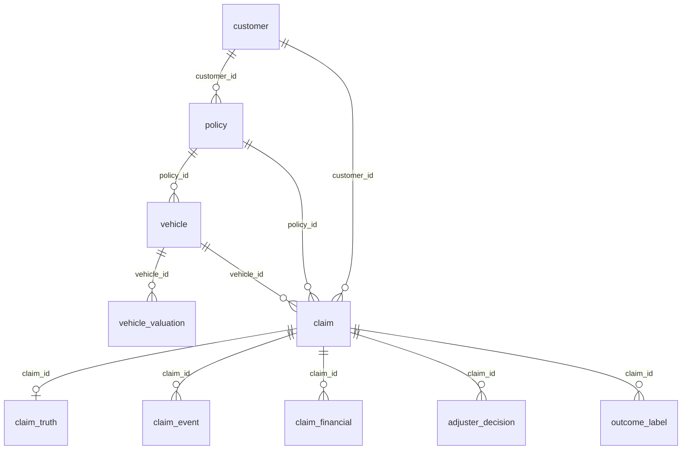

# Synthetic P&C data generator

Produces the **source tables** a carrier's policy admin and claims systems would
hold. It does not produce features — those are derived from these tables by the
Glue pipelines, which is the point.

```bash
python3 -m venv .venv && source .venv/bin/activate
pip install -r requirements.txt
python generate.py --config config.yaml
```

Runs in about 5 seconds and writes ~20 MB of Parquet to `./out/`.
Deterministic: same `seed` in `config.yaml` gives byte-identical output.

Every column in every table is documented in
[DATA_DICTIONARY.md](DATA_DICTIONARY.md). This README covers grain, keys,
and the faults; the dictionary covers types, nullability, and domains.

---

## Why generate rather than use a public dataset

Public insurance dataset — freMTPL2, Allstate Claims Severity, Porto Seguro — is a **flat modelling table**. 
One row per policy or claim, no entity
history, no event timestamps.
The generator's job produces data with four specific properties:

1. Every fact carries an **event timestamp**
2. Values **change over time**, so the offline store is a history and not a snapshot
3. Labels **mature at different rates**, so "what turned out true" depends on when you ask
4. A handful of **deliberate faults**, so the root-cause demo has something to find

Distributions are calibrated to published US personal auto experience.

---

## Tables

### Entity relationships



`salvage_market` (keyed by `month`) has no foreign key to anything — it is
joined by nearest month to `claim.loss_datetime` inside the generator, not
carried through as a relationship in the output tables.

### Table reference

Each table's **grain** is what one row means; the **key** is what makes a row
unique. `vehicle_valuation` and `outcome_label` are the two that trip people
up — read their notes before assuming "one row per entity." For column
types, nullability, and domains, see [DATA_DICTIONARY.md](DATA_DICTIONARY.md).

| Table | Rows | Grain / key | Columns |
|---|---|---|---|
| `customer` | 50,000 | one row per customer. **PK** `customer_id` | `customer_id`, `state`, `credit_band`, `customer_since`, `birth_year` |
| `policy` | 80,000 | one row per **annual term** — a renewing customer has several rows. **PK** `policy_id`. **FK** `customer_id` → `customer` | `policy_id`, `customer_id`, `state`, `effective_date`, `expiry_date`, `annual_premium`, `collision_deductible`, `comprehensive_deductible`, `has_rental`, `has_roadside` |
| `vehicle` | 95,000 | one row per vehicle, static attributes only — no ACV here. **PK** `vehicle_id`. **FK** `policy_id` → `policy`, `customer_id` → `customer` | `vehicle_id`, `policy_id`, `customer_id`, `vin`, `model_year`, `segment`, `msrp`, `mileage_est`, `added_date` |
| `vehicle_valuation` | ~1.1M | **one row per valuation event, not per vehicle.** No single-column PK — key is `(vehicle_id, valuation_datetime)`. Quarterly book values plus the FNOL-time value plus any later correction, all as separate rows. **FK** `vehicle_id` → `vehicle` | `valuation_id`, `vehicle_id`, `valuation_datetime`, `acv`, `source`, `supersedes_reason` |
| `claim` | 12,000 | one row per claim, FNOL-time facts only — no ground truth, no outcome. **PK** `claim_id`. **FK** `policy_id` → `policy`, `vehicle_id` → `vehicle`, `customer_id` → `customer` | `claim_id`, `policy_id`, `vehicle_id`, `customer_id`, `state`, `loss_datetime`, `fnol_datetime`, `cause_of_loss`, `reported_severity`, `airbag_deployed`, `vehicle_drivable`, `towed_from_scene`, `injury_reported`, `at_fault`, `num_vehicles_involved` |
| `claim_truth` | 12,000 | one row per claim — 1:1 with `claim`, kept as a separate table so it is never accidentally joined into a feature view. **PK / FK** `claim_id` → `claim` | `claim_id`, `truth_acv`, `truth_repair_estimate`, `truth_supplement`, `truth_repair_total`, `truth_tlt`, `truth_is_total_loss` |
| `claim_event` | ~91,000 | one row per lifecycle event (FNOL, photos, adjuster assigned, reserve, estimate, settlement, closed, ...). **PK** `event_id`. **FK** `claim_id` → `claim` | `event_id`, `claim_id`, `event_type`, `event_datetime`, `payload` (JSON string, shape depends on `event_type`) |
| `claim_financial` | ~26,000 | one row per money movement — reserve, payment, or recovery. Recovery amounts are negative, so summing `amount` gives net incurred. **PK** `txn_id`. **FK** `claim_id` → `claim` | `txn_id`, `claim_id`, `txn_type` (`RESERVE` \| `PAYMENT` \| `RECOVERY`), `amount`, `txn_datetime` |
| `adjuster_decision` | ~2,300 | one row per human override of a model decision — not every claim has one. **PK** `decision_id`. **FK** `claim_id` → `claim` | `decision_id`, `claim_id`, `adjuster_id`, `decision_datetime`, `human_decision`, `reason_code_family`, `reason_code`, `suspected_feature`, `adjuster_was_wrong` |
| `outcome_label` | ~42,000 | **one row per `(claim_id, label_type, label_as_of_date)`** — a claim has several rows here, one per maturity horizon it has reached. No single-column PK. **FK** `claim_id` → `claim` | `outcome_id`, `claim_id`, `label_type` (`incurred_net` \| `total_loss`), `label_value`, `label_as_of_date`, `label_maturity_days`, `is_final` |
| `salvage_market` | 37 | one row per calendar month. **PK** `month`. No FK — joined by nearest month inside the generator only | `month`, `used_value_index` |

`claim_truth` is separated deliberately. It holds the true ACV, the repair
total and the applied statutory threshold — everything you need to check
whether the platform behaved correctly, and everything a model must never
see.

---

## The deliberate faults

The following drifts have been introduced to the data — they exercise two different failure modes, and the platform handles them differently:

- **Fault 1 (concept drift)** happens continuously, in production, with no
  single bad actor. Nothing in the pipeline is broken — the statute changed.
  The only way to catch it is outcome monitoring: watch the total-loss rate
  itself, not the input features, because the features never move. This is
  a detection problem, and the honest answer is that a feature-drift
  dashboard alone will not catch it. Something has to be watching outcomes,
  not just inputs.

- **Fault 2 (stale valuation)** happens once, to a specific claim, because a
  vendor feed was late. The platform does not prevent this — a late feed is
  a late feed. What it does is make the claim auditable after the fact: the
  feature value used at scoring time is hashed and stored, so replaying the
  claim later shows a mismatch and proves the model decision was correct
  given what it saw. This is an audit/root-cause problem, not a detection
  problem — you are not trying to catch fault 2 as it happens, you are
  trying to explain it after someone asks "why did this claim get flagged
  wrong?"

So: fault 1 is there for the monitoring capability (Deequ + Evidently, drift
and data quality) — it demonstrates the specific gap that a feature-drift
dashboard alone will not catch a statutory change, since the features never
move. Fault 2 demos move 4 (root cause) — the platform's answer is "we can
prove what the model saw," not "we would have stopped this."

### 1. Concept drift — a statutory change

Massachusetts lowers its total-loss threshold from **75% to 60% on 1 March 2026**.
Result at the default settings:

```
collision total loss rate BEFORE : 22.4%   (n=1,726)
collision total loss rate AFTER  : 28.6%   (n=336)
```

**The input features do not change.** Vehicle values, damage severity, repair
estimates — all identical distributions before and after. Only the mapping from features to outcome moves.

Feature-distribution monitor won't see this drift.

> The 15-point move is larger than a typical statutory change, chosen so the
> effect is visible at lab volumes. Real US thresholds span 50–100% by state.

### 2. Stale valuations — the root-cause scenario

3% of claims are scored on an ACV that is understated by 10–25%. A correction
lands 2–5 days later.

The generator reports which claims have a decision that **flips** on the stale
value:

```
STALE VALUATIONS — 360 claims scored on an understated ACV
  of those, 19 would have the total-loss decision FLIP
  on the stale value. These are the root-cause demo claims:
    CLM-0000810
```

Worked example, `CLM-0000810`:

| | |
|---|---|
| ACV the model saw | **$14,325** ← `vendor_feed_stale` |
| ACV that was true | **$16,378** ← corrected two days later |
| Repair total | $11,147 |
| Statutory threshold | 75% |
| Ratio as served | **77.8% → TOTAL LOSS** |
| Ratio, true | **68.1% → repairable** |
| Ground truth | **repairable** |

The model got it wrong. The model was not at fault. Replay the feature today and
you get $16,378, which will not match the hash stored at scoring time — and that
mismatch is the finding.

### 3. Missing data, three different kinds

- **Mileage unknown** for 20% of vehicles — a genuinely missing measurement, and informative: an older vehicle with no odometer reading is a different risk from one with a known low reading
- **Photos never uploaded** for 22% of claims — absent because they will never exist
- **Photos not yet uploaded** at FNOL — absent *for now*. A different fact, and the reason the design carries a `feature_state` enum rather than a null

### 4. Reviewer behaviour

~19% of claims get an adjuster override, rising **1.8×** in December for business
reasons. Overrides carry a reason code from one of three families:

| Family | Codes |
|---|---|
| `feature` | `feature_value_wrong`, `stale_features`, `feature_missing` |
| `model` | `score_too_harsh`, `score_too_soft`, `unstable_vs_last_week` |
| `process` | `policy_exception`, `customer_goodwill`, `missing_document` |

About 30% of overrides are themselves wrong — tracked in
`adjuster_was_wrong`. Treating human decisions as ground truth is its own trap,
and the data lets you demonstrate it.

The December spike is policy drift that reads as model decay if you are not
separating the reason families.

### 5. A model feeding a model

`photo_damage_score` in the `PHOTOS_UPLOADED` event payload stands in for a
vision model. It is correlated with true damage plus noise, and it **degrades
from 1 July 2026** with a small positive bias.

That creates the dependency edge: when total loss gets something wrong, the
cause may be the vision model rather than the total-loss model. This is the
root-cause problem Kishore raised on the discovery call, made concrete.

---

## Label maturity

The table that makes the point:

```
LABEL MATURITY — mean net incurred by horizon:
     30d : $5,513
     90d : $7,198
    365d : $6,661
```

A label is only emitted once its horizon has actually elapsed by `end_date` — the
simulated "now". Claims reported late in the window correctly have no 30-day (or
even no total-loss) label yet, the same way a real system would have no such fact
on hand.

Incurred **rises** from 30 to 90 days as settlements land, then **falls** by 365
days as subrogation recoveries come in. Same claim, three different truths, all
correct as of their date.

Which is why `outcome_label` is append-only and keyed by
`(claim_id, label_type, label_as_of_date)` rather than one mutable outcome
column. Measure a severity model against the 30-day label and you will conclude
it over-predicts; against the 365-day label, that it under-predicts. Both
conclusions are wrong without stating the horizon.

---

## Tuning

Everything lives in `config.yaml`. The knobs most worth touching:

| Setting | Effect |
|---|---|
| `n_claims` | Volume. 12,000 gives ~2,100 total losses. Drop to 1,200 for a fast smoke test — but note the drift becomes invisible at that size |
| `claim.repair_ratio_mu` | Shifts the total-loss rate. Higher → more total losses |
| `tlt_change.new_tlt` | Concept drift magnitude |
| `stale_acv.share_of_claims` | How many root-cause demo candidates exist |
| `adjuster.reason_mix` | Balance of feature vs model vs process attribution |
| `seed` | Change for a different but statistically identical dataset |

**Calibration check:** the default settings produce a **21.1% total-loss rate on
collision claims**, which is roughly where US personal auto sits given current
used-vehicle values and repair costs. If insurer's actual rate is
materially different, adjust `repair_ratio_mu` — a base rate that looks wrong to
an actuary loses the room before you get to the platform.

---

## What comes next

These are source tables. The feature pipelines in `../modules/compute` read them
and produce the five feature groups, writing an offline row **only when a value
changes** — not a daily snapshot. A customer's `prior_claims_36mo` changes when
they file a claim, and also when an old claim ages out of the 36-month window,
which is the kind of thing hand-rolled feature code routinely gets wrong.
